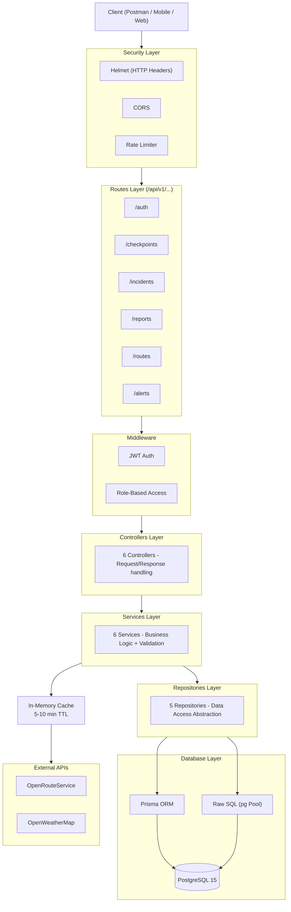
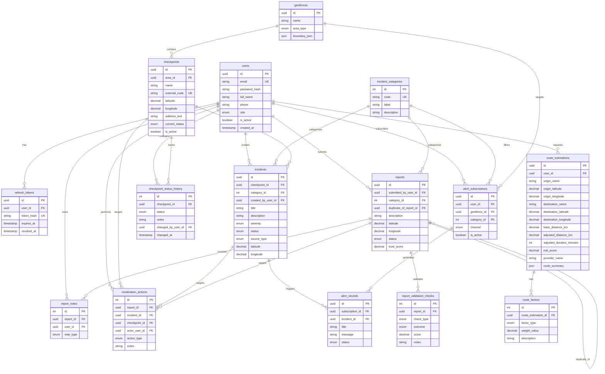

# Wasel Palestine API

**Smart Mobility & Checkpoint Intelligence Platform**

A RESTful API backend designed to help Palestinian citizens navigate safely and efficiently across the West Bank. The system provides real-time checkpoint status tracking, crowdsourced incident reporting, intelligent route estimation with risk scoring, and an alert notification system.

> Built for **Advanced Software Engineering** course — Spring 2026, An-Najah National University.

---

## Tech Stack

| Component | Technology | Justification |
|-----------|-----------|---------------|
| Runtime | Node.js 20 | Non-blocking I/O for high-throughput API handling; large ecosystem |
| Framework | Express 5 | Lightweight, flexible routing; middleware-based architecture for clean separation |
| Database | PostgreSQL 15 | Robust relational DB with advanced query support (FILTER, JSON); ACID compliance |
| ORM | Prisma 5 | Type-safe queries, auto-migrations, schema-as-code for maintainability |
| Raw SQL | pg (node-postgres) | Direct pool queries for complex aggregations where ORM adds unnecessary overhead |
| Auth | JWT + bcryptjs | Stateless access tokens + secure refresh rotation; no session storage needed |
| Security | Helmet, CORS, express-rate-limit | Industry-standard HTTP hardening with minimal performance cost |
| External APIs | OpenRouteService, OpenWeatherMap | Open-source routing + real-time weather for contextual route intelligence |
| Deployment | Docker + Docker Compose | Reproducible environment; single-command setup with DB healthcheck |
| API Docs | Apidog / Postman | Interactive API documentation with test execution |
| Load Testing | Grafana k6 | Modern load testing with detailed metrics (p95, throughput, error rate) |

---

## Architecture

The project follows a **Layered Architecture** with clear separation of concerns:



**Why Layered Architecture?**
- **Separation of concerns**: Each layer has a single responsibility
- **Testability**: Services can be tested independently from HTTP layer
- **Maintainability**: Changes in one layer don't cascade to others
- **Scalability**: Layers can be optimized independently

---

## Database Schema (ERD)

The database contains **15 models** organized into 7 domains:



---

## Features

| # | Feature | Description | Endpoints |
|---|---------|-------------|-----------|
| 0 | Health Check | API availability verification | 1 |
| 1 | Authentication | Register, Login, Refresh, Logout, Profile (JWT + RBAC) | 5 |
| 2 | Checkpoints | CRUD + status updates + history + area filtering + pagination | 8 |
| 3 | Incidents | CRUD + verify/close + stats + severity/category filters + pagination | 12 |
| 4 | Reports | Crowdsourced submissions + voting + validation + moderation | 5 |
| 5 | Route Estimation | ORS + Weather + heuristic fallback + risk scoring | 1 |
| 6 | Alerts | Subscriptions by area/category + alert delivery + mark read | 4 |
| | **Total** | | **36** |

---

## Quick Start

### Prerequisites
- Docker & Docker Compose

### 1. Clone & Configure
```bash
git clone https://github.com/AhmadMayyaleh122/wasel-palestine-api.git
cd wasel-palestine-api
```

### 2. Create `.env` file
```env
JWT_ACCESS_SECRET=your_access_secret
JWT_REFRESH_SECRET=your_refresh_secret
ORS_API_KEY=your_openrouteservice_key
OPENWEATHER_API_KEY=your_openweathermap_key
```

### 3. Run with Docker
```bash
docker compose up --build
```

### 4. Verify
```bash
curl http://localhost:3000/api/v1/health
# → {"status":"OK","version":"v1"}
```

The system automatically runs database migrations and seeds 8 incident categories on startup.

---

## API Endpoints

Base URL: `http://localhost:3000/api/v1`

### Authentication
| Method | Endpoint | Auth | Description |
|--------|----------|------|-------------|
| POST | `/auth/register` | No | Register user |
| POST | `/auth/login` | No | Login and receive tokens |
| POST | `/auth/refresh` | No | Refresh access token |
| GET | `/auth/me` | Yes | Current user profile |
| POST | `/auth/logout` | Yes | Logout and revoke refresh token |

### Checkpoints
| Method | Endpoint | Auth | Description |
|--------|----------|------|-------------|
| GET | `/checkpoints` | No | List all (filter by status, search, paginate) |
| GET | `/checkpoints/:id` | No | Get by ID with active incidents |
| GET | `/checkpoints/:id/status-history` | No | Full status change history |
| GET | `/checkpoints/areas/:areaId/checkpoints` | No | Filter by geographic area |
| POST | `/checkpoints` | Yes | Create new checkpoint |
| PUT | `/checkpoints/:id` | Yes | Update details |
| PUT | `/checkpoints/:id/status` | Yes | Update status (records history) |
| DELETE | `/checkpoints/:id` | Yes | Soft deactivate |

### Incidents
| Method | Endpoint | Auth | Description |
|--------|----------|------|-------------|
| GET | `/incidents` | No | List all (filter, sort, paginate, search) |
| GET | `/incidents/stats` | No | Aggregated statistics (raw SQL) |
| GET | `/incidents/high-severity` | No | High and critical severity |
| GET | `/incidents/by-checkpoint/:id` | No | By checkpoint |
| GET | `/incidents/by-category/:id` | No | By category |
| GET | `/incidents/:id` | No | Get by ID with relations |
| POST | `/incidents` | Yes | Report new incident |
| PUT | `/incidents/:id` | Staff | Update details |
| PUT | `/incidents/:id/status` | Staff | Change status |
| POST | `/incidents/:id/verify` | Staff | Verify incident |
| POST | `/incidents/:id/close` | Staff | Close incident |
| DELETE | `/incidents/:id` | Staff | Delete |

### Crowdsourced Reports
| Method | Endpoint | Auth | Description |
|--------|----------|------|-------------|
| POST | `/reports` | Yes | Submit (auto duplicate detection + validation) |
| POST | `/reports/:id/vote` | Yes | Vote confirm or deny |
| PUT | `/reports/:id/status` | Staff | Moderation status update |
| GET | `/reports` | Staff | List all (paginated, filter by status) |
| GET | `/reports/:id` | Staff | Get by ID |

### Route Estimation
| Method | Endpoint | Auth | Description |
|--------|----------|------|-------------|
| POST | `/routes/estimate` | Yes | Estimate route with risk scoring |

### Alerts & Subscriptions
| Method | Endpoint | Auth | Description |
|--------|----------|------|-------------|
| POST | `/alerts/subscriptions` | Yes | Create alert subscription |
| GET | `/alerts/subscriptions` | Yes | List my subscriptions |
| GET | `/alerts` | Yes | List my alerts |
| PUT | `/alerts/:id/read` | Yes | Mark alert as read |

> Full interactive documentation available on **Apidog**. Feature numbering matches the Wiki.

---

## External API Integrations

### OpenRouteService (Routing)
- **Purpose**: Real driving route calculation between coordinates
- **Endpoint**: `POST /v2/directions/driving-car/geojson`
- **Auth**: API key in Authorization header
- **Fallback**: Haversine formula + congestion/checkpoint/area penalty factors
- **Caching**: 5-minute TTL, key = origin→destination+constraints
- **Timeout**: 10 seconds via AbortController

### OpenWeatherMap (Weather)
- **Purpose**: Weather impact on route safety and travel time
- **Endpoint**: `GET /data/2.5/weather`
- **Auth**: API key as query parameter
- **Impact**: Rain/snow (+12 min, +2.5 risk), fog (+8 min, +1.8 risk), wind >10 m/s (+4 min, +1.2 risk)
- **Caching**: 10-minute TTL, coordinate-rounded keys (~1km precision)
- **Timeout**: 10 seconds, estimation continues without weather on failure

---

## Performance Testing (k6)

All 5 scenarios passed with **0% error rate**:

| Scenario | VUs | Avg RT | p95 | Throughput | Errors |
|----------|-----|--------|-----|------------|--------|
| Read-Heavy | 100 | 39.6 ms | 137.68 ms | 90.25 req/s | 0% |
| Write-Heavy | 50 | 191.7 ms | 387.39 ms | 20.83 req/s | 0% |
| Mixed (70/30) | 50 | 41.39 ms | 125.2 ms | 27.84 req/s | 0% |
| Spike | 200 | 173.49 ms | 647.3 ms | 99.69 req/s | 0% |
| Soak (6.5 min) | 30 | 15.44 ms | 37.45 ms | 16.21 req/s | 0% |

See `k6-tests/` directory and the Performance Report for detailed analysis.

---

## Security

- **Helmet** — Secure HTTP headers (X-Frame-Options, CSP, HSTS)
- **Rate Limiting** — 200 req/15 min (global), 20/15 min (auth)
- **JWT Rotation** — Short-lived access tokens + revocable refresh tokens with hash storage
- **RBAC** — citizen / moderator / admin roles enforced via middleware
- **Password Hashing** — bcryptjs with salt rounds
- **Input Validation** — Coordinate range checks, required fields, enum enforcement

---

## Project Structure

```
wasel-palestine-api/
├── index.js                    # Entry point
├── package.json                # Dependencies & scripts
├── Dockerfile                  # Container build config
├── docker-compose.yml          # Multi-service orchestration (app + PostgreSQL)
├── .dockerignore               # Build exclusions
├── prisma/
│   ├── schema.prisma           # Database schema (15 models, 12 enums)
│   └── migrations/             # Versioned DB migrations
├── src/
│   ├── app.js                  # Express setup, middleware, route mounting
│   ├── config/env.js           # Environment variable validation
│   ├── controllers/            # 6 request handlers
│   ├── services/               # 6 business logic modules
│   ├── repositories/           # 5 data access modules
│   ├── routes/                 # 6 route definitions
│   ├── middlewares/
│   │   └── authMiddleware.js   # JWT verification + RBAC
│   ├── prisma/
│   │   └── prismaClient.js    # Prisma client singleton with pg adapter
│   └── db/
│       ├── database.js         # Raw SQL connection pool (pg)
│       └── seed.js             # Incident category seeder (8 categories)
├── k6-tests/                   # 5 performance test scenarios
│   ├── 01-read-heavy.js
│   ├── 02-write-heavy.js
│   ├── 03-mixed-workload.js
│   ├── 04-spike-test.js
│   └── 05-soak-test.js
└── Wasel-Palestine-API.postman_collection.json
```
